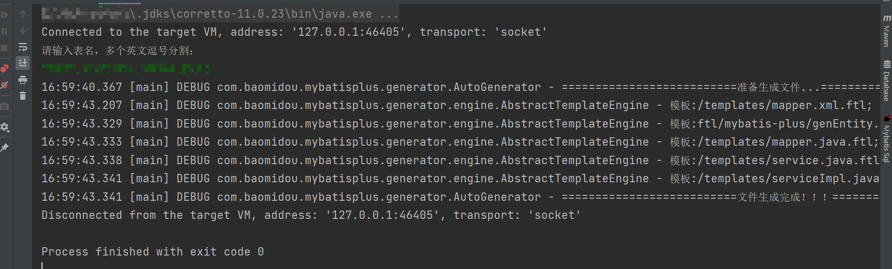

# mybatis-plus_demo

## 一个简单的springboot + mybatis-plus自动生成CRUD代码学习demo

## 使用方法

- 改文件utils文件夹下的CodeGenerator.java文件配置为你的数据库配置，并运行main方法

  ```java
      private final static String DATABASE_URL = "jdbc:mysql://localhost:3306/synthesize?useUnicode=true&useSSL=false&characterEncoding=utf8";
      private final static String USERNAME = "root";
      private final static String PASSWORD = "root";
      private final static String DRIVER_NAME = "com.mysql.jdbc.Driver";
  ```

  - DRIVER_NAME可选值

    | 数据库类型 | 值                              |
        | :--------- | ------------------------------- |
    | mysql      | com.mysql.jdbc.Driver           |
    | oracle     | oracle.jdbc.driver.OracleDriver |


- 控制台输入输入表名称，然后回车就会生成对应的文件，具体的配置查看注释
  


## 测试

### 提供了基本的crud测试接口样例

测试方法

- 更改文件application-dev.yml 配置为你的数据库配置

```yml
  datasource:
    url: jdbc:mysql://127.0.0.1:3306/synthesize?useUnicode=true&characterEncoding=utf8&useSSL=true&autoReconnect=true&nullCatalogMeansCurrent=false
    username: syn
    password: syn_123456
```

- 调用接口
  - 略

